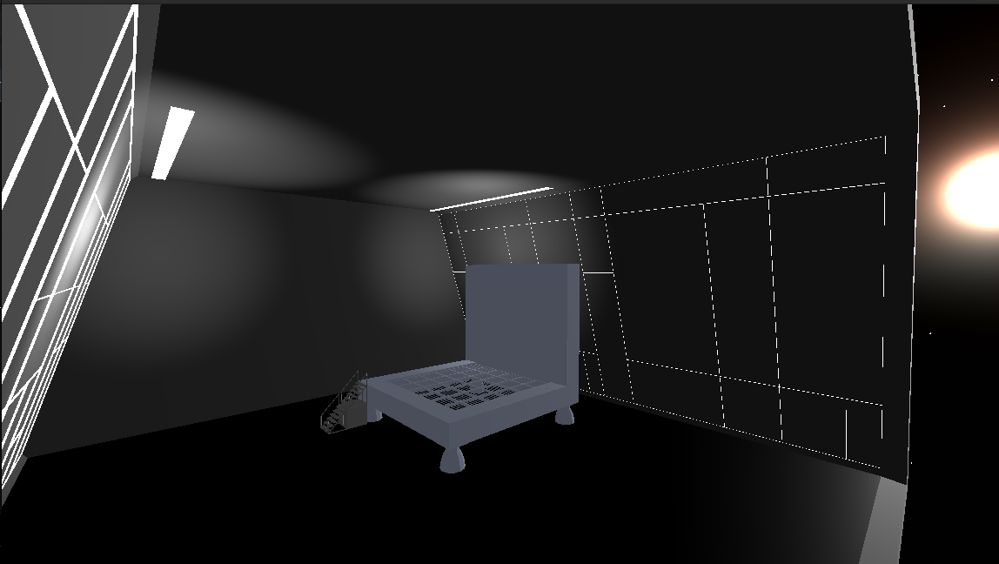

# stardust

I've been learning godot and decided it would be a good test of my pubmarine networking server/protocol

It was surprisingly easy to get voxel meshes to build, so I'm deciding to continue and put this on github.

## implemented
- ChunkData - generic voxel storage data structure
- Chunk - renderable, uses Godot API and ChunkData to render blocks
  - needs hidden face marking/culling, UVs, materials, raycast picking
- pubmarine/client - connects to a (pubmarine)[github.com/repcomm/pubmarine] server
  - needs JSON and protocol handling, but does connect
- some basic 3d models for blocks and a space hanger
